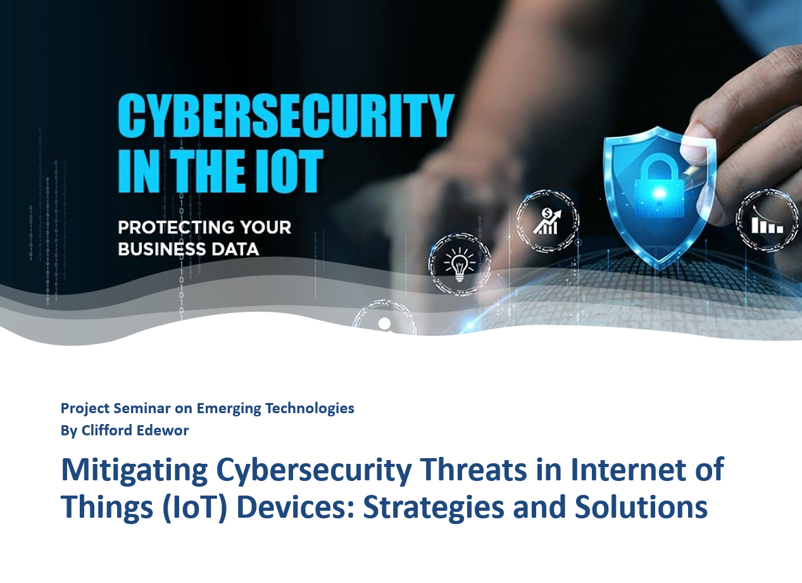
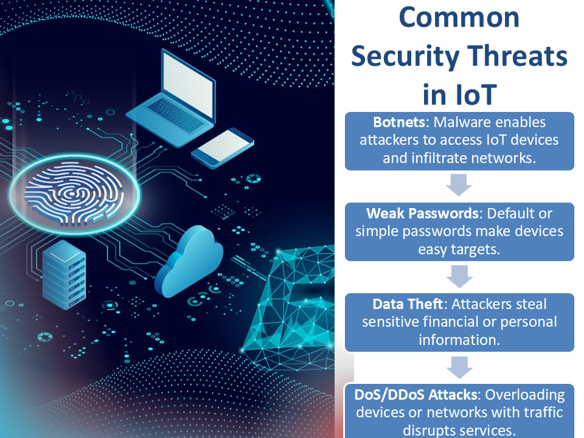
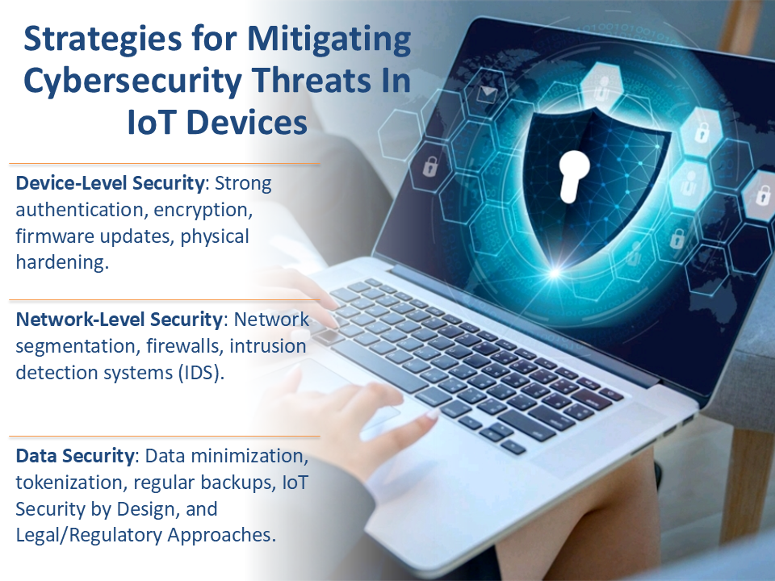
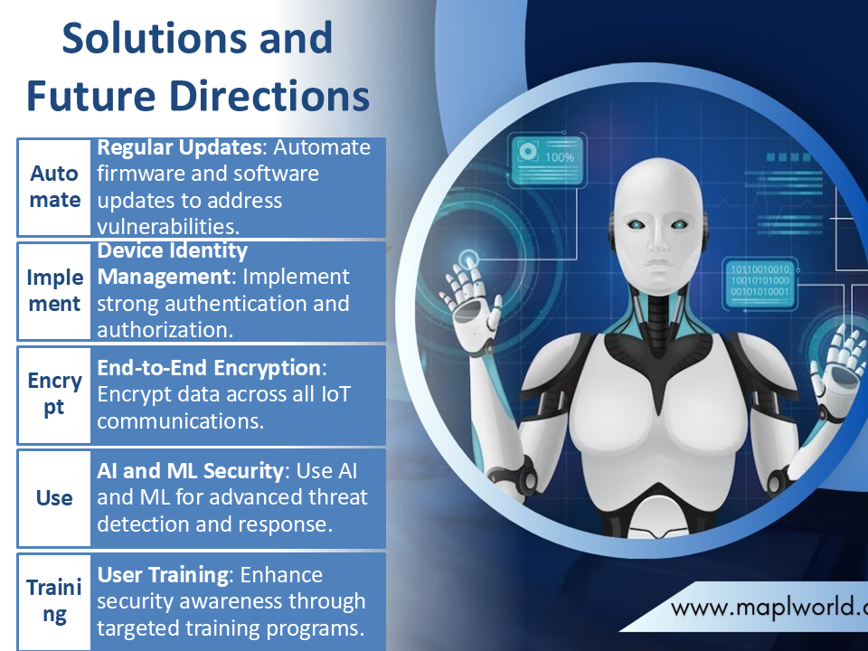

# IoT Security: Mitigating Cybersecurity Threats in Connected Devices

This project explores the security challenges of Internet of Things (IoT) ecosystems and demonstrates practical strategies to mitigate risks. It focuses on device-level, network-level, and data security controls to strengthen resilience against cyber threats.

## 🎯 Objectives
- Identify common vulnerabilities in IoT devices and networks.  
- Simulate cyberattacks targeting IoT systems.  
- Apply mitigation techniques to reduce risks.  
- Propose best practices for securing IoT environments.  

## 🛡️ Strategies Applied
**Device-Level Security**  
- Strong authentication mechanisms  
- Data encryption and secure firmware updates  
- Physical device hardening  

**Network-Level Security**  
- Network segmentation  
- Firewalls and Intrusion Detection Systems (IDS)  
- Secure communication protocols (TLS/SSL, MQTT with authentication)  

**Data Security**  
- Data minimization and tokenization  
- Regular backups  
- IoT security by design principles  
- Legal and regulatory compliance approaches  

## 🔧 Technologies & Tools
- Wireshark (traffic analysis)  
- Snort IDS  
- IoT device emulators/testbeds  
- Secure protocols and configurations  

## 📸 Project Presentation 

### IoT Security Project Cover Slide

### Common IoT Security Threats

### IoT Threat Mitigation Strategies

### IoT Security Solutions & Future Directions

📄 [**Download Full IoT Security Presentation (PDF)**](assets/IoT_Security_Presentation.pdf)

## 📚 Use Case
This project was developed as part of an academic research initiative under the **Computer Science Department** at the **Petroleum Training Institute (PTI), Nigeria**. It demonstrates the application of layered security strategies to protect IoT ecosystems across device, network, and data layers.

## 📄 License
For educational demonstration and academic research.
