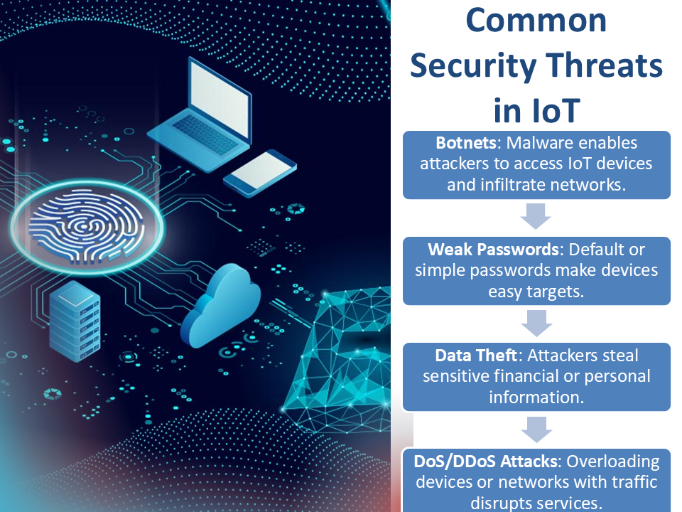
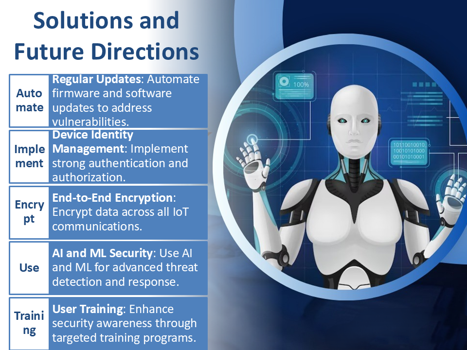

# Engineering Security Controls for Internet of Things (IoT) Environments

This repository documents the security architecture, threat analysis, and layered security controls developed to improve the resilience of Internet of Things (IoT) environments against common cyber threats.

Rather than focusing on a single technology or device, the project examines how security can be applied across the entire IoT ecosystem from connected devices and communication networks to data protection and operational monitoring.

The work demonstrates a structured approach to analysing threats, selecting appropriate security controls, and designing layered defences that reduce cyber risk across connected environments.

## 🎯 Security Design Objectives

The project was developed to examine practical security controls that improve the resilience of connected device environments.

The primary objectives were to:
- Analyse common attack vectors targeting Internet of Things (IoT) systems.
- Evaluate security controls across device, network, and data layers.
- Apply defence-in-depth principles to reduce cyber risk.
- Map practical mitigation techniques to representative attack scenarios.
- Demonstrate how layered security improves the overall resilience of IoT environments.

## 🛡️ Threat Model

The project evaluates representative threats commonly observed within Internet of Things environments and maps appropriate security controls to each scenario.

| Threat Scenario | Security Objective | Security Control |
|-----------------|--------------------|------------------|
| Weak Authentication | Prevent unauthorised access | Strong passwords, MFA |
| Botnet Malware | Reduce compromise of connected devices | Firmware updates, IDS monitoring |
| Network Reconnaissance | Limit attacker visibility | Network segmentation, firewalls |
| Data Interception | Protect sensitive information | TLS/SSL encryption |
| Device Compromise | Improve device resilience | Secure configuration and hardening |

## 🔐 Layered Security Architecture
***Device Layer***
- Strong authentication mechanisms
- Secure firmware management
- Device hardening
- Physical protection

***Network Layer***
- Network segmentation
- Firewalls
- Intrusion Detection Systems (IDS)
- Secure communication protocols (TLS/SSL, MQTT Authentication)

***Data Layer***
- Encryption in transit
- Encryption at rest
- Backup and recovery
- Data integrity controls

## 🏛 Security Architecture

The security model follows a defence-in-depth approach in which multiple security controls protect different components of the IoT environment.

```text
               IoT Devices
                     │
                     ▼
            Secure Communication
             (TLS / MQTT / HTTPS)
                     │
                     ▼
           Network Gateway / Router
                     │
        ┌────────────┴────────────┐
        ▼                         ▼
   Firewall                  IDS Monitoring
        │                         │
        └────────────┬────────────┘
                     ▼
             Security Monitoring
             & Incident Response
```

Each layer contributes to reducing the likelihood and impact of successful cyber attacks while improving visibility across the environment.

## 🛠 Reference Technologies

- Wireshark
- Snort IDS
- MQTT
- TLS/SSL
- Network Segmentation
- Firewall Technologies
- IoT Communication Protocols
- Security Monitoring Concepts

## 📸 Project Presentation 

### IoT Security Project Cover Slide


### Common IoT Security Threats


## 🌍 Representative Attack Scenarios: Mirai & Meris Botnet


## 📊 Security Control Mapping

| Attack | Primary Risk | Security Control |
|---------|--------------|------------------|
| Mirai Botnet | Device compromise | Strong authentication, firmware management |
| Meris Botnet | Router exploitation | Patch management, network segmentation |
| Data Theft | Confidentiality loss | Encryption and secure communication |
| DDoS | Service disruption | IDS monitoring, rate limiting, firewalls |
| Weak Credentials | Unauthorised access | Password policy, MFA |

### IoT Threat Mitigation Strategies


## 🚀 Future Security Considerations


📄 [**Download Full IoT Security Presentation (PDF)**](assets/IoT_Security_Presentation.pdf)

## 📚 Engineering Relevance
Although the project focuses on security architecture rather than software implementation, the documented security controls reflect practices commonly applied when designing secure Internet of Things environments.

The layered security model, threat analysis, and mitigation strategies presented here align with industry approaches for protecting connected devices, reducing attack surfaces, and strengthening cyber resilience across distributed IoT ecosystems.

## 💡 Lessons Learned
Developing this project reinforced the importance of designing security into Internet of Things environments from the outset rather than relying solely on reactive protection.

Key observations include:
- Layered security provides significantly stronger protection than individual security controls.
- Network visibility remains essential for detecting abnormal device behaviour.
- Secure communication and authentication reduce opportunities for compromise.
- Security architecture should be considered during system design rather than after deployment.

## 📄 License
This project is intended for educational demonstration, academic research, and portfolio presentation purposes.
